# University Flow System

Created as a part of Web Applications Course at AGH University Of Krakow.


## Technologies used

Client:
- React
- Material UI (MUI)
- react-router-dom
  
Backend:
- Node.js
- Express.js
- MongoDB
- bcrpyt

## Postman docs
[Here's a link to Postman documentation of the API](https://documenter.getpostman.com/view/47347148/2sB3dVNSp5)


## Setup and local run
**Frontend**:
```bash
cd client
npm i
npm run dev
```
You will also need a .env file, example:
```bash
VITE_API=https"//localhost:3031
```

**Backend**
```bash
cd backend
npm i
npm run dev
```
You will also need a .env file, example:
```bash
PORT=3031
MONGO_URI=mongodb://......
JWT_SECRET=....
FRONTEND_URL=http://localhost:5173
```
Application will run on localhost:5173 by default

## Database structure
This MongoDB database uses 4 collections:
- users: all users information, admins, teachers and students
- courses: course data: name, course code, assigned teachers, assigned students, classes that this course offers and grades for them
- conversations: list of conversations between users
- messages: each message is a document in this collection, that is connected to conversations

## What is it?
This is a lightweight university management system designed to simplify administrative and academic tasks. It allows users to:
- Add and manage courses
- Create and manage teacher and student accounts
- Send messages between users
- Record and track grades and final scores
- Manage class schedules

## How does it work?
### User Roles & Permissions

The system supports three types of user accounts, each with specific capabilities:

### Admin
Administrators have full control over the system:
- Create and manage **student** and **teacher** accounts
- Create, update, and remove **courses**
- Assign **teachers** and **students** to courses
- Define and manage **course schedules**

### Teacher
Teachers can manage their academic responsibilities:
- View their **personal schedule**, which may include classes from multiple courses
- Assign **grades** and **final grades** to students enrolled in their courses
- Generate **Excel reports** of final grades across all courses

### Student
Students can track their academic progress:
- View their **personal schedule**
- Access their **grades** and **final grades**

---

## Messaging System

All users (Admins, Teachers, and Students) have access to a built-in messaging system that allows them to communicate directly with one another.

# Screenshots

Below is a gallery of application screenshots.
<p align="center" >
  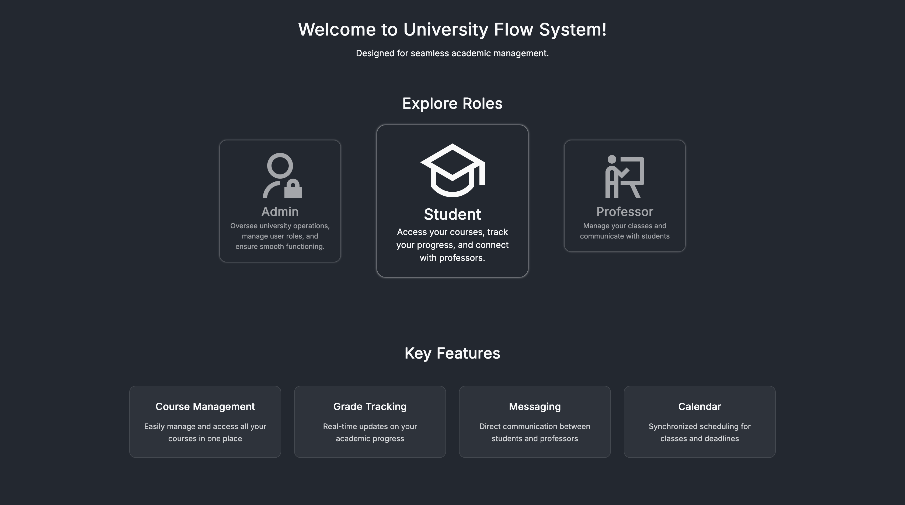
  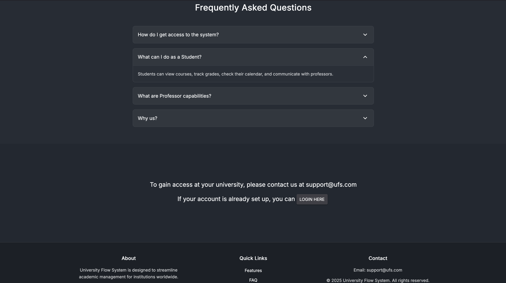
</p>

<p align="center">
  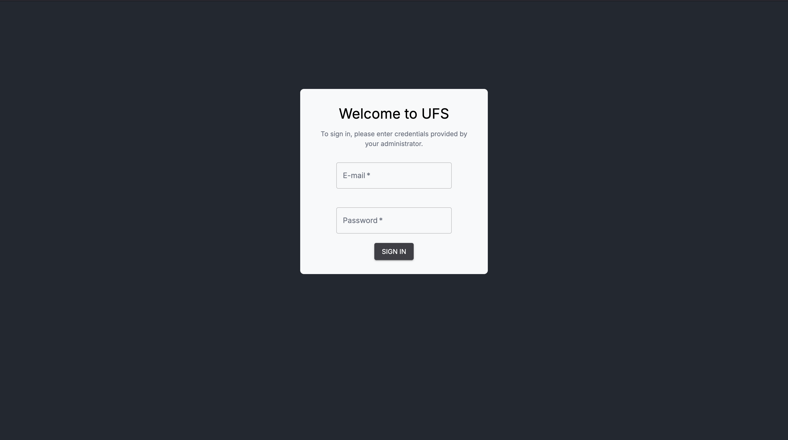
</p>
<p align="center" >
  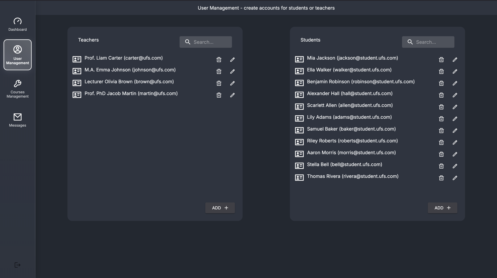
  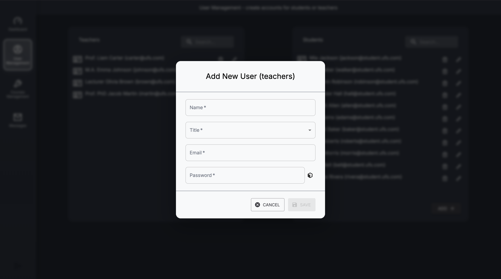
</p>
<p align="center" >
  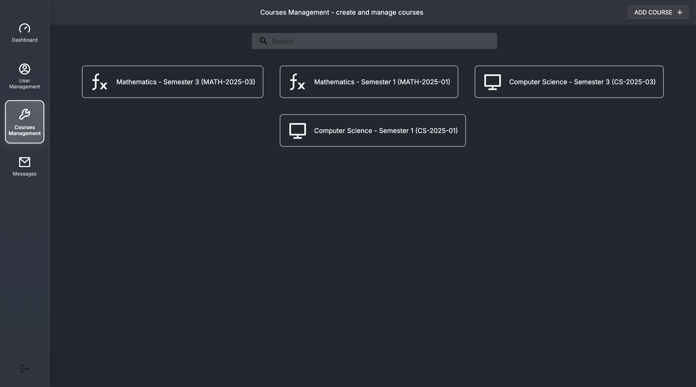
  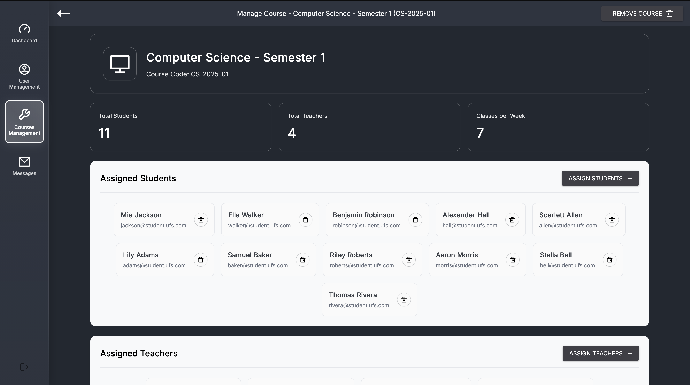
</p>
<p align="center" >
  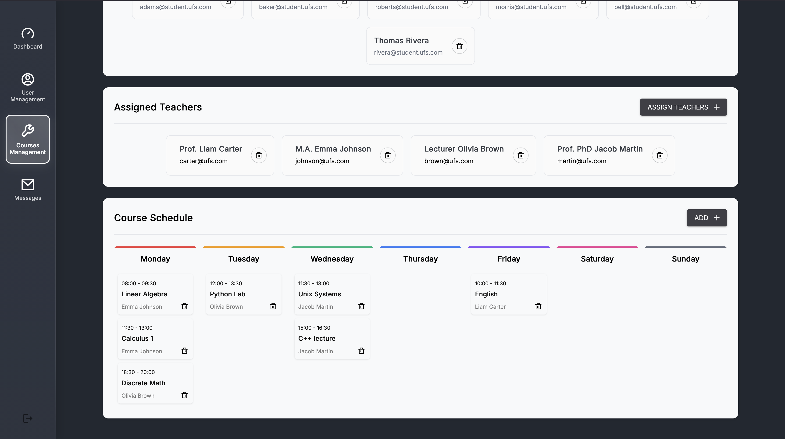
</p>
<p align="center" >
  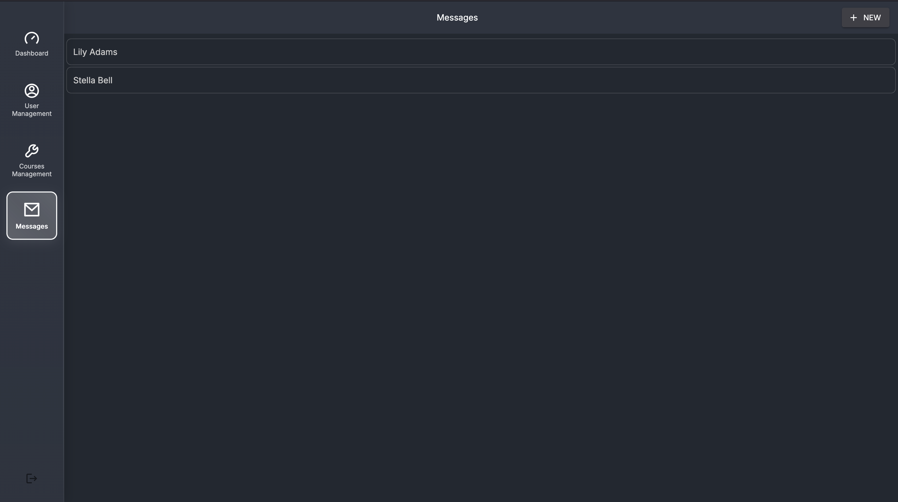
  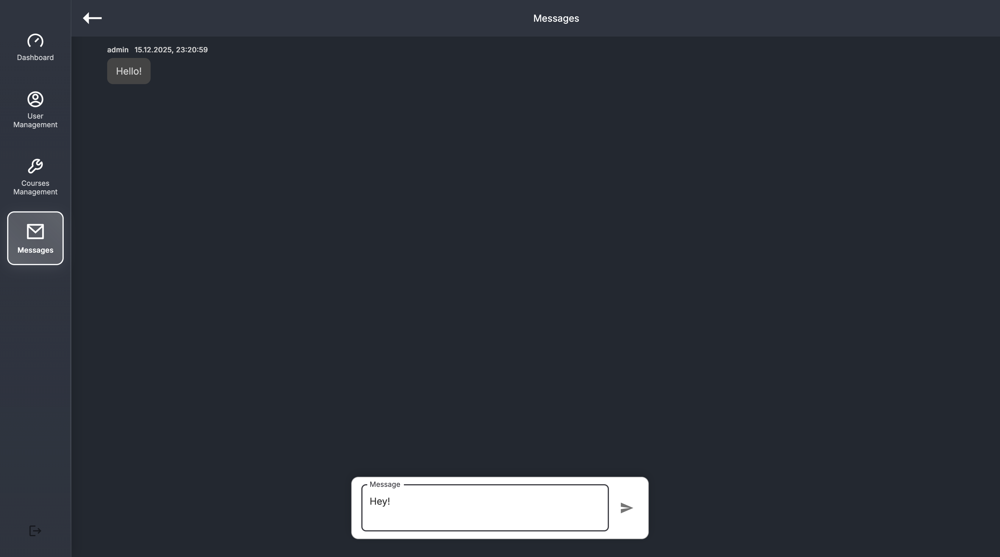
</p>
<p align="center" >
  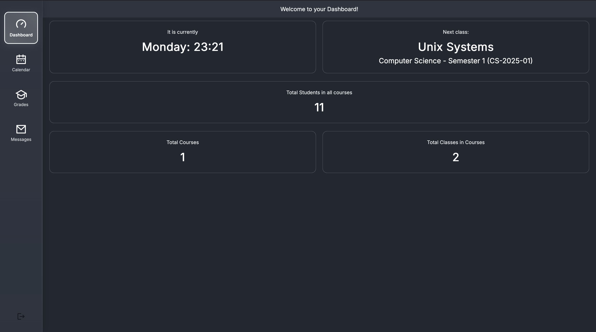
  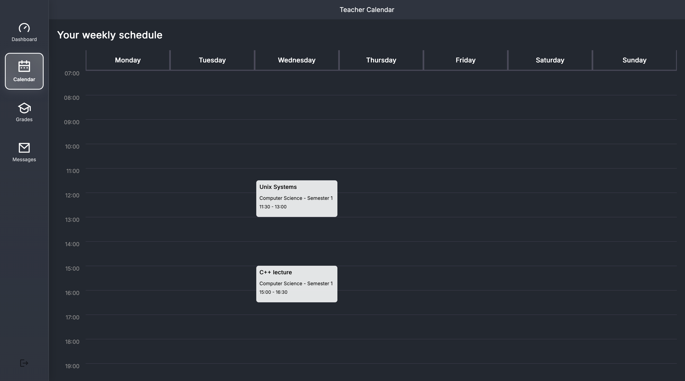
</p>
<p align="center" >
  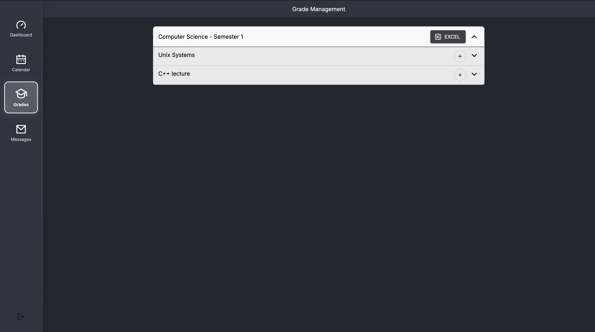
  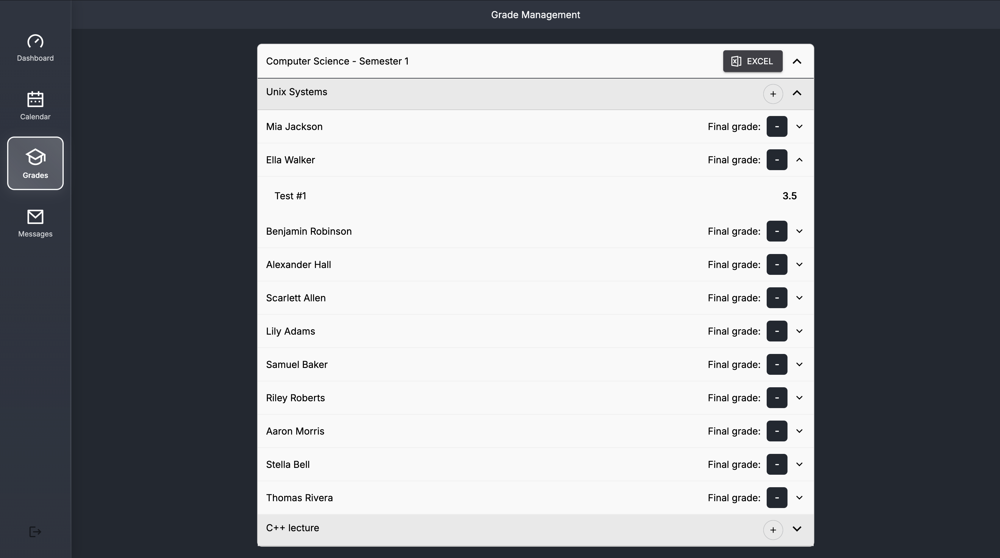
</p>
<p align="center" >
  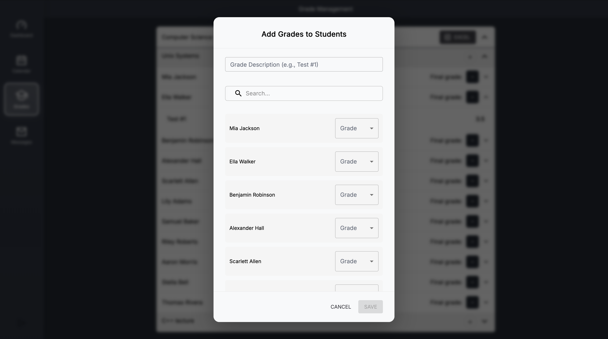
  
</p>
<p align="center" >
  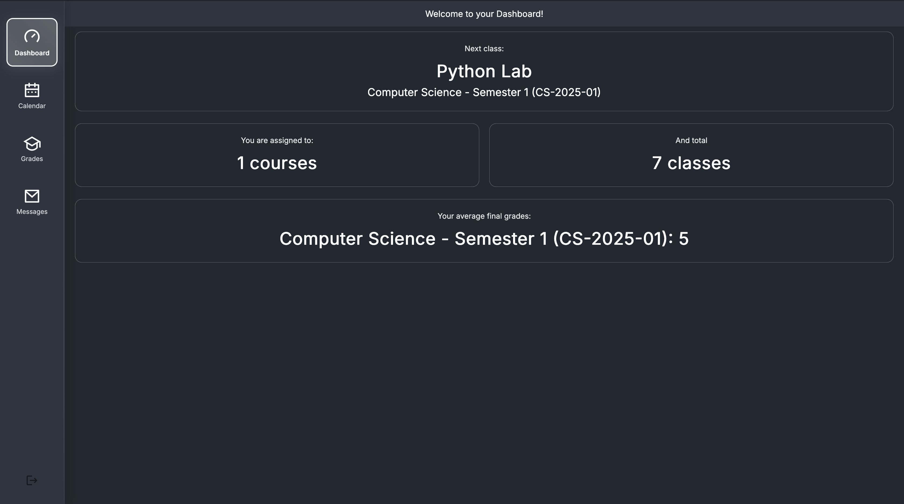
  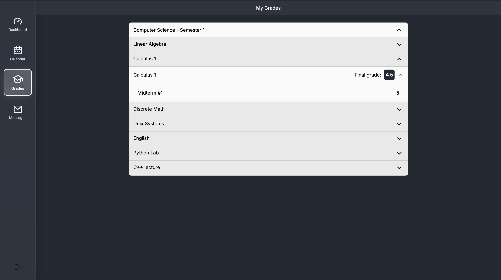
</p>
<p align="center" >
    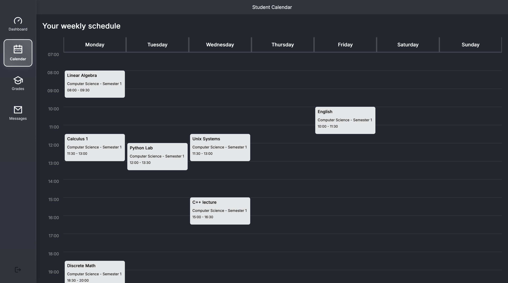
</p>


